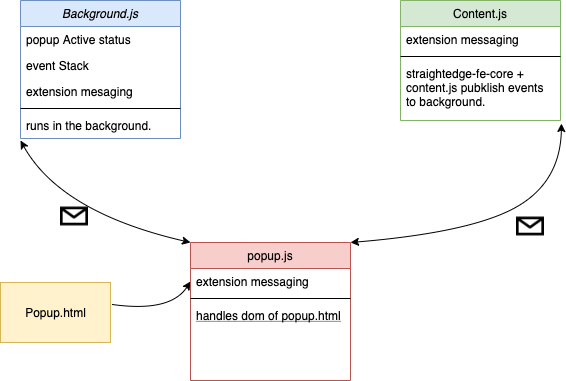

# Straightedge-fe

Straightedge-fe is the chrome browser extension that listens to the events of the target webpage and pushes the events to the straightedge app.

### Installation
- Run the install script. 
```
sh ./install.sh
```
- open the extensions settings on chrome: [chrome://extensions](chrome://extensions)
    - click on ``load unpacked`` button.
    - select [straightedge-fe](#Straightedge-fe) folder.
    - enable the extension.

### Architecture


### RoadMap
- bundle the package.
- Native or REST communication with straightedge application.

### License
GNU General Public License v3.0 or later

See [COPYING](./COPYING) file to see the full text.